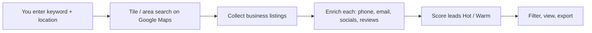

# 🧠 BrainLead — The Google Maps Business Extractor

> **Turn any Google Maps search into a clean, scored, export-ready lead list — in one click.**


**BrainLead** (also shipped as *Google Map Extractor* / *Maps Business Extractor*) is a desktop lead-generation engine that scrapes Google Maps, enriches every business with deep contact data, scores the hottest leads, and exports them — no coding, no browser extensions, no manual copy-paste.

---

## 🚀 Why BrainLead?

| Pain point                              | BrainLead solves it                                                     |
| --------------------------------------- | ----------------------------------------------------------------------- |
| Copy-pasting results by hand            | One-click extract → structured table → CSV / report                    |
| No idea which leads are worth calling   | Automatic **lead scoring** (Hot / Warm) from reviews, site, socials    |
| Thin contact info on Google             | Enriches with **email, phone, website, socials, hours, menu, reviews** |
| Slow manual searches                    | **Concurrent threads (1–16)** for parallel tile search + enrichment    |
| One city at a time                      | **Multi-city & area-grid scans** run every location automatically      |
| Proxy bans                              | Built-in **proxy pool** with per-request rotation                      |

---

## ✨ Features

- 🔎 **Keyword + Location search** — e.g. `plumber` in `toronto`, or batch `Restaurants + Abuja, Lagos, Kano`.
- 🗺️ **Area Scan (coordinate grid)** — drop a polygon and BrainLead tiles it, finds businesses in every tile, and de-duplicates.
- 📞 **Deep enrichment** — pulls phone, website, **email addresses**, social profiles (Facebook, Instagram, X, LinkedIn, YouTube), opening hours, menu, and review counts.
- 🔥 **Lead scoring** — every business gets a **Hot / Warm** score so reps call the best fits first.
- 🧹 **Smart filters** — `Has email`, `Has social`, `Has website`, `Has phone`, `Min rating`, `Min reviews`, `Hot leads only`.
- ⚡ **Concurrency control** — a single **Concurrent threads (1–16)** slider drives both search and enrichment speed.
- 🕸️ **Proxy pool** — upload proxies and rotate them per request to stay under rate limits.
- 📜 **History & re-score** — every job is saved; re-run scoring or export filtered subsets anytime.
- 📄 **Reports & export** — save filtered results to a shareable report.
- 🔐 **Activation** — free tier (limited / search) with in-app activation for unlimited use.

---

## 🖥️ Quick Start (Windows)

1. Download / locate **`BrainLead.exe`** (single file, ~48 MB).
2. **Double-click** it. A local server starts and your browser opens:
   ```
   http://127.0.0.1:8000
   ```
3. On first run, activate via the in-app **Activate** button (free tier is limited to 50 results / search).
4. Enter a **Keyword**, a **Location**, set **Concurrent threads**, and hit **New Extraction**.

> 💡 **Heads-up:** Windows Defender / some AV may flag `BrainLead.exe` as a false positive — it is an obfuscated PyInstaller one-file bundle. Add an exclusion for the file (or its folder) if it is blocked or quietly deleted.

---

## 🔍 How It Works



1. **Search** — BrainLead queries Google Maps for your keyword/location (or tiles an area grid).
2. **Enrich** — each business is fetched in parallel (up to your thread count) to pull deep contact + social data.
3. **Score** — leads are ranked so the highest-potential businesses float to the top.
4. **Export** — filter by any signal and save the list.

---

## 🎯 Lead Scoring & Filters

Results are sorted **Lead score: high → low**. Use the filter bar to isolate exactly the leads you want:

- 🔥 **Hot leads only**
- ✉️ **Has email** · 🌐 **Has website** · 📱 **Has phone** · 📱 **Has social** · 🕒 **Has hours** · 🍽️ **Has menu**
- ⭐ **Minimum rating** · 💬 **Minimum reviews**
- 🌍 **Country** filter + saved filter presets

Each result card shows: name, category, rating, review count, address, phone, website, emails, social links, and a **lead-score badge**.

---

## 🌍 Multi-City & Area Scans

BrainLead is built for **scale**:

- Separate keywords or cities with commas / newlines — `Restaurants + Abuja, Lagos, Kano` scans **every city automatically**.
- **Area scan** mode tiles a coordinate grid over a region, searches each tile, and merges + de-duplicates results.
- Neighborhood-level accuracy is enhanced with a curated **gazetteer** (e.g. Abuja & Lagos) so district names resolve correctly.

---

## ⚙️ Settings & Concurrency

| Setting            | What it does                                                          |
| ------------------ | -------------------------------------------------------------------- |
| **Concurrent threads** | Parallelism for tile search **and** enrichment (1–16). Higher = faster. |
| **Country**        | Sets the Google market (`gl`/`hl`) automatically from your choice.  |
| **Max results**    | Cap results per search (saved in Settings).                          |
| **Proxy pool**     | Upload proxies; BrainLead rotates them per request.                  |

> The app resolves the search region from your **country** selection — you never touch `gl`/`hl` directly.

---

## 🔐 Data & Privacy

BrainLead is a **local desktop tool** — everything runs on *your* machine. State lives in your user profile and survives restarts:

```
C:\Users\<you>\AppData\Roaming\BrainLead\
├── data\
│   ├── app.db            # job history + extracted businesses (SQLite)
│   ├── settings.json     # saved settings (threads, country, max results)
│   ├── cookies.enc       # saved Google session
│   ├── secret.key        # local encryption key
│   ├── licensing\        # saved license data
│   └── job_runs.log      # append-only run audit log
├── stdout.log            # server / startup output
└── stderr.log            # errors / tracebacks (check this first if it fails)
```

To start completely fresh, close the app and delete the `BrainLead` folder under `%APPDATA%`.

---

## 🛠️ Build From Source

Requires **Python 3.10** (e.g. conda env `build310`), `pyarmor` 9.1.x, and `pyinstaller`.

```bash
# 1) install deps
pip install -r requirements.txt
pip install python-multipart pyarmor==9.1.6

# 2) build the frontend (or sync an existing frontend/dist)
cd frontend && npm install && npm run build && cd ..

# 3) make the PyInstaller spec
pyi-makespec --onefile --noconsole --name BrainLead \
    --add-data "frontend/dist;frontend/dist" \
    --hidden-import backend.licensing --hidden-import multipart \
    --collect-all curl_cffi launcher.py

# 4) obfuscate + bundle
python -m pyarmor.cli gen --pack BrainLead.spec -r launcher.py backend
```

Output: **`dist/BrainLead.exe`**.

---

## 🧱 Tech Stack

- **Backend:** Python · FastAPI · uvicorn · curl_cffi (browser impersonation)
- **Frontend:** React (Vite) single-page web UI served by the bundled server
- **Enrichment:** async detail/review/scrape clients with proxy rotation
- **Obfuscation:** PyArmor 9 (no clear-text source shipped)
- **Packaging:** PyInstaller 6 (one-file Windows bundle)

---

## 📜 Disclaimer

BrainLead is intended for **legitimate business development, market research, and lead enrichment** by users who comply with Google's Terms of Service and all applicable data-protection laws (e.g. GDPR / CCPA). Do not use it for spam, harassment, or unlawful data collection. The authors are not responsible for misuse.

---

## 🤝 BrainLead

Built by **BrainLead** — we turn public business data into actionable pipelines.

- 🐦 **@BrainLead**
- 🤖 **@brainleadbot**

© Google Map Extractor · BrainLead. All rights reserved.
