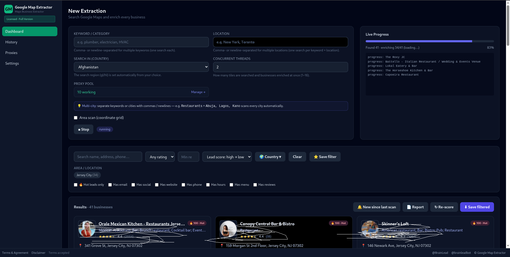

# 🧠 BrainLead Google Map Extractor

> **The all-in-one lead engine that turns Google Maps into a finished, scored, sales-ready prospect list — automatically.**



**BrainLead Google Map Extractor** is a desktop lead-generation powerhouse built by **BrainLead**. It scrapes any Google Maps search or drawn area, digs deep into every business's website to uncover emails and socials other tools miss, scores each lead with an explainable 0–100 system, and exports straight into your CRM. No coding. No browser extensions. No copy-paste marathons.

---

## 🚀 Why Teams Run on BrainLead Google Map Extractor

- **Find** any business, in any city, in any country — by keyword, by location, or by drawing an area on the map.
- **Know** exactly who to call first, because every lead arrives pre-scored (Hot / Warm / Cold) with a plain-English reason.
- **Reach** decision-makers with emails, phone numbers, websites **and** social profiles pulled from the business's own site.
- **Scale** from a single street to an entire metro area, automatically, with parallel threading and a rotating proxy pool.
- **Export** into CSV, Excel, Google Sheets, or straight into **HubSpot, Salesforce, or Zoho** — ready to import.

---

## ✨ Features — Everything the Tool Does

### 🔎 Search & Discovery
1. **Keyword + Location search** — e.g. `plumber` in `New York`, or batch `Restaurants + New York, Los Angeles, Chicago`.
2. **Multi-city batch scans** — separate keywords or cities with commas / newlines; BrainLead Google Map Extractor scans **every city automatically**.
3. **Category autocomplete** — smart suggestions as you type.
4. **Area Scan (draw a region)** — drop a polygon on the map and the tool tiles it automatically.
5. **Coordinate-grid coverage** — the area is split into a grid so no street or block is missed.
6. **Tile preview** — see exactly how many tiles will be searched *before* you spend a single request.
7. **Automatic de-duplication** — duplicate businesses across tiles and cities are merged into one clean record.
8. **Live real-time progress** — a live progress bar with scraped/enriched counts, streamed as the job runs.
9. **Worldwide market detection** — the right country & language (`gl`/`hl`) is resolved automatically from the area or your selection. Works in **any country**, not a fixed list.
10. **"New since last scan" comparison** — diff two scans and surface only the fresh businesses you haven't seen.

### 📇 Deep Business Data (35+ fields per business)
11. Business **name**, **category**, **full address**, street, city / state / zip.
12. **Phone number** (properly formatted).
13. **Website**.
14. **Email address** (extracted from Google *and* the company's own site).
15. **Social profiles** — Facebook, Instagram, LinkedIn, X (Twitter), YouTube, and **TikTok**.
16. **Star rating** + **review count**.
17. **Review mining** — author, rating, full text, date, and photos.
18. **Business attributes** — amenities, service options, highlights, and "popular for".
19. **Price level** (Inexpensive → Very Expensive) with description.
20. **Opening hours** (full weekly schedule).
21. **Popular-times / busyness** heatmap, by hour and by day.
22. **Menu / services** link.
23. **Geo-coordinates** (lat/lng), `place_id`, `cid`, `gid`, and timezone.
24. **Business thumbnail / photo**.
25. **Closed-status detection** — permanently/temporarily closed businesses are flagged and kept out of your list.

### 🕵️ Website Intelligence (the hidden layer)
26. **Website scraping** for buried emails + socials, following Contact / About subpages automatically.
27. **Domain age** via WHOIS — how long have they actually been in business?
28. **CMS detection** — WordPress, WooCommerce, Shopify, React.
29. **SSL certificate** check (secure or not — an easy upgrade pitch).
30. **Contact-form detection** (lead-generation opportunity).
31. **Live-chat detection** — tawk.to, Intercom, Zendesk, Crisp, Drift, LiveChat, Jivo, HubSpot, Tidio.
32. **Analytics & Facebook Pixel** detection (are they already running ads?).
33. **Mobile-ready (viewport)** check.

### 🔥 Lead Scoring Engine (explainable, not a black box)
34. **0–100 Lead Score** with **Hot (≥70) / Warm (45–69) / Cold (<45) / Closed** grades.
35. **Plain-English reasons** — e.g. *"No website — prime web-design / SEO lead."*
36. **Machine tags** for filtering (`no_website`, `no_social`, `chain`, `low_reviews`…).
37. **3 scoring presets** — *Needs Help* (upsell / web-design / SEO leads), *Quality* (established businesses), and *Custom* (your own weights, saved in Settings).
38. **21 weighted factors** — website, SSL, contact form, email, social, reviews, rating, domain age, runs ads, category fit, and more.
39. **National chain / franchise detection** — McDonald's, Starbucks, etc. are auto down-weighted (corporate decides, not the local owner).
40. **Category-fit detection** for web / SEO / marketing services.
41. **Closed-business hard disqualifier** — scored 0 so you never waste outreach on a dead listing.
42. **On-demand re-score** — re-rank new *and* historical leads with the latest model in one click.

### ⚡ Speed, Scale & Stealth
43. **Concurrent threads (1–16)** drive both search and enrichment in parallel.
44. **Built-in proxy pool** — bulk upload (`ip:port` and `ip:port:user:pass`), auto-test, and per-request rotation.
45. **Resilient fetching** — automatic retries and request jitter keep long scans running.

### 🗂️ Jobs, Filters & Export
46. **Job history** — every extraction is saved and re-openable anytime.
47. **Smart filters** — Has email, Has social, Has website, Has phone, Min rating, Min reviews, Hot leads only, Country, Area/location, and **saved filter presets**.
48. **Export to CSV** (Excel-friendly UTF-8).
49. **Export to Excel (XLSX)** — styled headers, frozen header row, auto-filter.
50. **Export to JSON**.
51. **Export to Google Sheets** — one click, appends to a live sheet.
52. **CRM-ready exports** — **HubSpot, Salesforce, and Zoho** with column-mapped import templates.
53. **Shareable report view**.
54. **Settings persistence** — default proxy, threads, country, max results, and scoring weights are saved.
55. **In-app activation** — Free evaluation tier and full Licensed version.
56. **Offline grace** — an activated license keeps working without internet.
57. **Local-first & private** — everything runs on *your* machine; nothing leaves your PC except what you choose to export.
58. **Encrypted, HWID-bound license storage**.

---

## 🎯 How It Works

1. **Search** — enter a keyword + location, or draw an area; BrainLead Google Map Extractor queries Google Maps (or tiles your region).
2. **Enrich** — each business is fetched in parallel, its website scraped for emails + socials, and its tech profile built.
3. **Score** — leads are ranked Hot / Warm / Cold with human-readable reasons.
4. **Export** — filter by any signal and send the list to CSV, Excel, Google Sheets, or your CRM.

Results are sorted **Lead score: high → low**. Each card shows name, category, rating, reviews, address, phone, website, emails, socials, web-tech chips, and a **lead-score badge**.

---

## 🌍 Multi-City & Area Scans

BrainLead Google Map Extractor is built for **scale**:

- Separate keywords or cities with commas / newlines — `Restaurants + New York, Los Angeles, Chicago` scans **every city automatically**.
- **Area scan** tiles a coordinate grid over any region you draw, searches each tile, and merges + de-duplicates results.
- "New since last scan" compares two runs so you only chase *fresh* opportunities.
- The country/market is detected automatically — you never configure regions by hand.

---

## 👥 Who Is It For?

- **Lead generation & marketing agencies** — package scored, enriched lists as a service.
- **Sales teams** — skip the research and call the hottest, most reachable businesses first.
- **Web / SEO / marketing consultants** — the scoring engine literally *finds* businesses with no website, no SSL, or no socials.
- **Recruiters & researchers** — map every relevant business in a territory in minutes.
- **Entrepreneurs** — build a hyper-targeted prospect list for any niche, anywhere.

---

## 🔓 Free vs Licensed

- **Free evaluation tier** — limited to **50 results per search** and a small area-scan tile cap. Perfect for a quick test drive.
- **Licensed full version** — unlimited results, unlimited area scans, and all features unlocked. Activate in-app with a license key.

Upgrade and manage your license from the in-app **Activate** screen.

---

## 🔐 Data & Privacy

BrainLead Google Map Extractor is a **local desktop tool** — everything runs on *your* machine. Your data lives in your user profile and survives restarts:

```
C:\Users\<you>\AppData\Roaming\BrainLead\
├── data\            # job history, settings, saved session
├── stdout.log       # startup output
└── stderr.log       # errors (check this first if something fails)
```

To start completely fresh, close the app and delete the `BrainLead` folder under `%APPDATA%`.

---

## 🤝 Need a Custom Tool, Script, or Software?

**BrainLead builds custom tools, automation scripts, and software for businesses.**

If you need a lead generator, a data pipeline, a scraper, a dashboard, or any bespoke software — **we can build it for you.**

- 🌐 **Website:** https://brainlead.dev
- 🐦 **@BrainLead**
- 🤖 **@brainleadbot**
- ✉️ **brain_lead@outlook.com**
- 💬 **https://t.me/BrainLead**

© BrainLead. All rights reserved.
